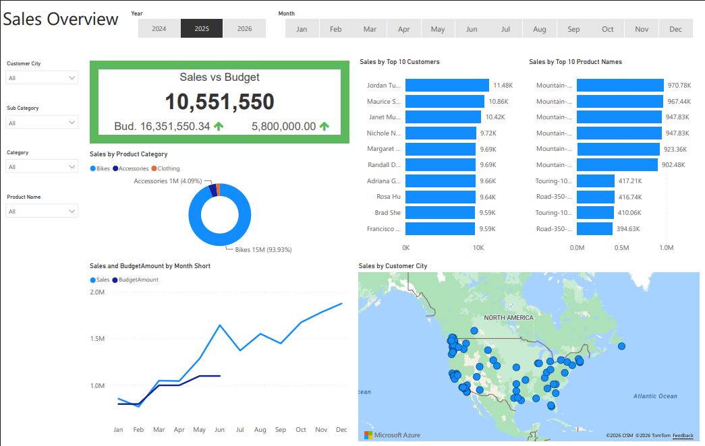
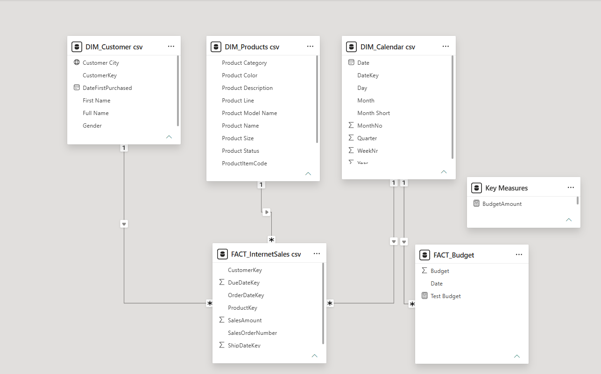

# Sales Performance Analysis | SQL & Power BI

## Project Overview

This project analyzes sales performance across customers, products, product categories, time periods, and geographic locations. I used SQL to query and prepare the data and Power BI to build the data model, create DAX measures, and develop an interactive sales performance dashboard.

The dashboard provides a consolidated view of sales performance and allows users to compare actual sales against budget, identify top-performing customers and products, and analyze monthly and geographic sales trends.

## Dashboard

## Business Questions

This analysis was designed to answer questions such as:

- How are actual sales performing compared with budget?
- Which customers generate the highest sales?
- Which products generate the highest sales?
- Which product categories contribute the most sales?
- How does sales performance change throughout the year?
- Where are sales geographically concentrated?

## Tools & Technologies

- **SQL** – Data querying, joins, transformations, and preparation
- **Power BI** – Data modeling and dashboard development
- **Power Query** – Data transformation
- **DAX** – Measures and KPI calculations
- **Excel / CSV** – Source data
- **GitHub** – Project documentation and version control

## Data Preparation

The project uses customer, product, calendar, internet sales, and budget data.

SQL queries were used to prepare the dimension and fact datasets used in Power BI.

The original budget source contained dates from 2020–2021. During data preparation, the reporting dates were transformed to 2024–2025 to align the budget data with the reporting period used in the dashboard.

The SQL queries used for the project are included in this repository.

## Data Model

The Power BI model connects customer, product, calendar, sales, and budget data using fact and dimension tables.

## DAX & Measures

DAX measures were created to calculate key performance indicators, including:

- Total Sales
- Budget Amount
- Sales vs. Budget Variance

These measures allow the dashboard to dynamically respond to the selected year, month, customer, product, and category filters.

## Dashboard Features

The interactive Power BI dashboard includes:

- Sales vs. Budget KPI
- Year and month slicers
- Customer City filter
- Product Category and Subcategory filters
- Product filter
- Monthly Sales vs. Budget analysis
- Top 10 Customers
- Top 10 Products
- Product Category analysis
- Geographic sales analysis

## Key Insights

The dashboard enables users to quickly identify:

- Differences between actual sales and budget targets
- Highest-performing customers and products
- Sales contribution by product category
- Monthly changes in sales performance
- Geographic concentrations of customer sales

## Repository Contents

- `Sales_Performance_Analysis_Report.pbix` – Complete Power BI report
- `dashboard_preview.png` – Dashboard preview
- `dashboard_preview.pdf` – PDF version of the dashboard
- `data_model.png` – Power BI data model
- `.sql` files – SQL queries used to prepare the datasets
- `.csv` files – Prepared datasets used in the analysis
- `Budget Sheet.xlsx` – Original budget source file

## How to View the Project

### View the Dashboard
The dashboard preview is displayed above and a PDF version is included in this repository.

### Explore the Power BI Report
Download `Sales_Performance_Analysis_Report.pbix` and open it using Power BI Desktop to interact with the complete report.

### Review the SQL
The SQL query files included in the repository show how the customer, product, calendar, and sales datasets were prepared for analysis.

## Skills Demonstrated

- SQL querying
- Data transformation
- Data modeling
- Fact and dimension table relationships
- DAX measure development
- KPI development
- Interactive dashboard design
- Business intelligence reporting
